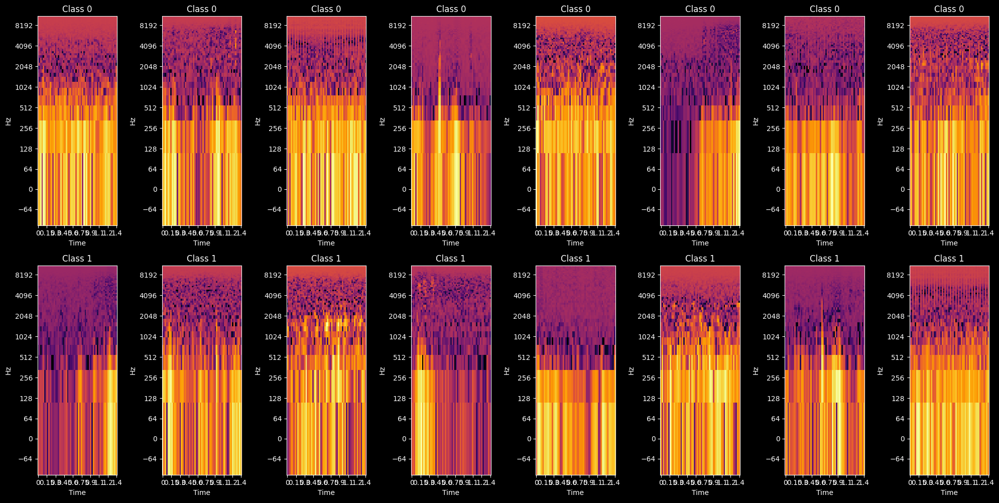
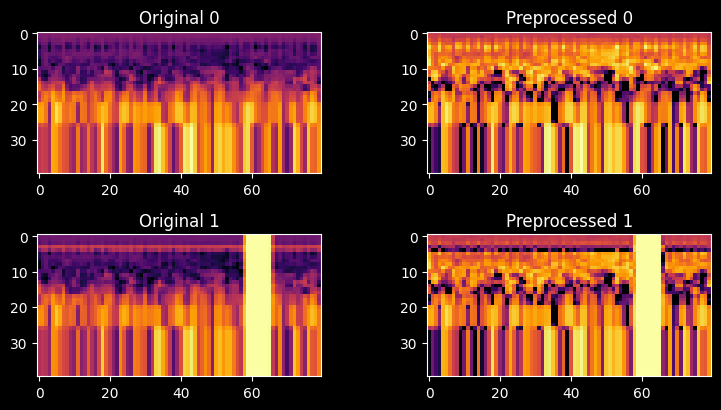

# EEG Spectrogram Analysis

## Overview
This notebook explores sleep spectrogram data to analyze frequency components across time during different sleep stages. The analysis includes preprocessing, data augmentation, and model training using deep learning techniques.

---

## Data Preprocessing
The notebook uses **Librosa** for feature extraction and applies data augmentation techniques to handle data imbalance:
1. **Time Warping**: Shifts spectrogram timing to learn invariant features.
2. **Frequency Masking**: Blocks random frequency bands to increase noise robustness.
3. **Time Masking**: Hides time segments to simulate incomplete data.

### Dataset Splitting
The dataset is divided into training, validation, and test sets to tune hyperparameters and evaluate final performance.

---

## Model Development
### Attempts:
1. **Deep CNN**: Initial complex model with poor performance.
2. **Simple Linear Model**: Less complex but inadequate results.
3. **Simpler CNN**: Reduced layers, yielding better results.

### Optimizations:
- **Learning Rate Scheduling**: Warm scheduling improved training.
- **Loss Function**: Weighted Cross-Entropy Loss tackled class imbalance.
- **Regularization**: Dropout, batch normalization, and L2 regularization minimized overfitting.

---

## Results
The final model achieved better performance after fine-tuning with augmented data and optimized training strategies.

---

### Saving the Model
The trained model is saved for future inference and validation.

--- 
### Key References:
- [Learning Representations from EEG with Deep Recurrent-Convolutional Neural Networks](https://paperswithcode.com/paper/learning-representations-from-eeg-with-deep)  
- [EEGNet: A Compact Convolutional Network for EEG-based Brain-Computer Interfaces](https://paperswithcode.com/paper/eegnet-a-compact-convolutional-network-for)  
- [SleepNet](https://github.com/akaraspt/tinysleepnet)  
- [Sleep-EDF Dataset](https://www.physionet.org/content/sleep-edfx/1.0.0/#files-panel)